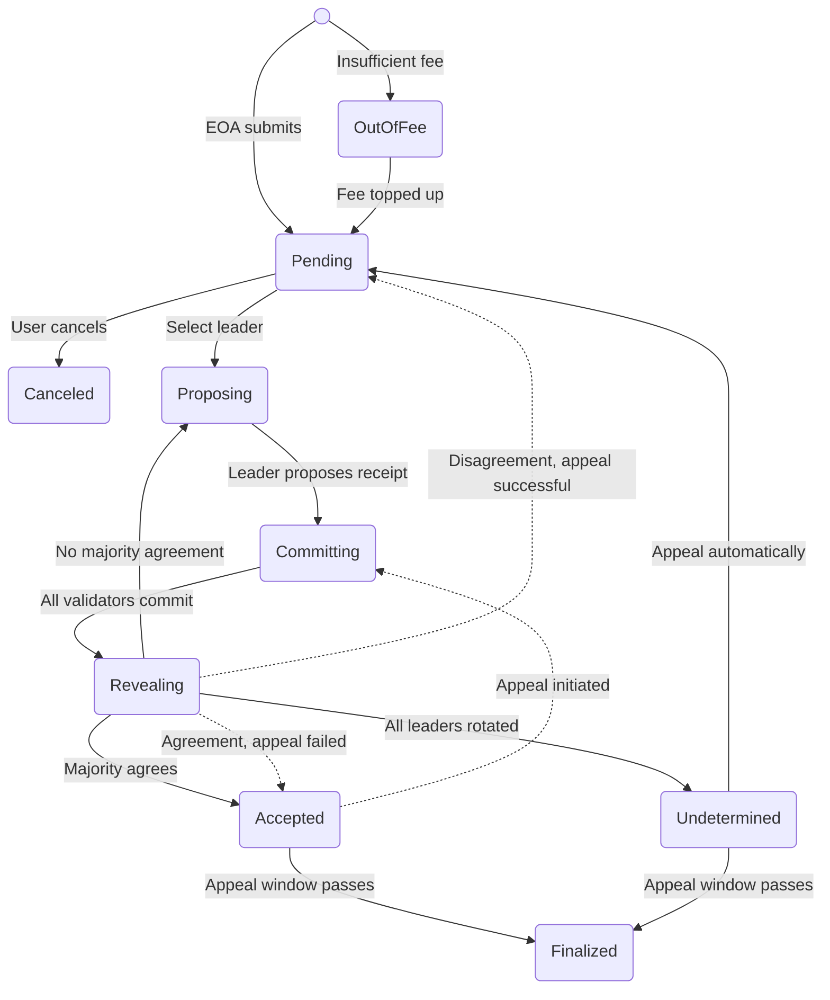

## Transaction execution
Once a transaction is received and properly verified by the `eth_sendRawTransaction` method on the RPC server, it is stored with a PENDING status and its hash is returned as the RPC method response. This means that the transaction has been validated for authenticity and format, but it has not yet been executed. From this point, the transaction enters the GenLayer consensus mechanism, where it is picked up for execution by the network's validators according to the consensus rules.

As the transaction progresses through various stages—such as proposing, committing, and revealing—its status is updated accordingly. Throughout this process, the current status and output of the transaction can be queried by the user. This is done by calling the `eth_getTransactionByHash` method on the RPC server, which retrieves the transaction’s details based on its unique hash. This method allows users to track the transaction’s journey from submission to finalization, providing transparency and ensuring that they can monitor the outcome of their transactions in real-time.

### Transaction Status Transitions

