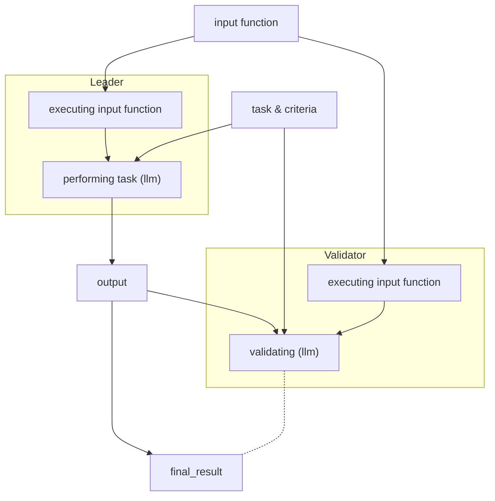

import { Callout } from 'nextra-theme-docs'

# Non comparative equivalence principle explanation

GenLayer SDK provides function `gl.eq_principle_prompt_non_comparative` for handling most scenarios that require performing subjective NLP tasks

## Data flow

