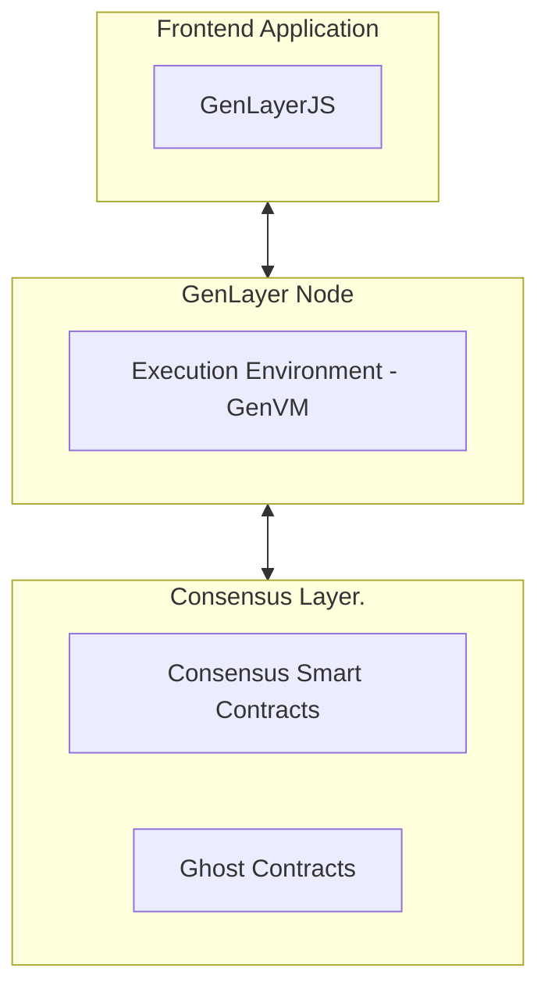

# Architecture Overview of Decentralized Applications Using GenLayer

A decentralized application (DApp) on GenLayer leverages its unique blockchain architecture to integrate AI-powered smart contracts, called "Intelligent Contracts." These DApps consist of various components that work together to ensure seamless interaction with the GenLayer protocol.

## Key Components

### Frontend Application
The user interface of the DApp is typically built with web technologies like HTML, CSS, and JavaScript. It communicates with the backend using the GenLayerJS SDK, enabling interaction with the GenLayer protocol and handling user inputs to trigger blockchain transactions.

### GenLayerJS SDK
A TypeScript/JavaScript library that abstracts the complexities of blockchain interactions. The SDK provides APIs to read from and write to Intelligent Contracts, manages accounts and queries transactions, and acts as the bridge between the frontend and GenLayer's protocol.

### Consensus Layer
The consensus layer implements GenLayer's Optimistic Democracy mechanism to ensure reliable and secure execution of transactions using a validator-driven commit-reveal scheme. It also handles appeals and transaction finality to maintain integrity and fairness.

It is built on ZK-stack rollups to provide scalability and cost-efficiency, secure state updates, and anchoring to Ethereum's security model.

### Execution Environment
The execution environment (the GenVM) is the engine that executes Intelligent Contracts. It supports both deterministic and non-deterministic operations, enabling AI integration and web data access.

### Ghost Contracts
Ghost contracts are proxy smart contracts on the consensus layer that facilitate interactions between accounts and Intelligent Contracts. They also manage external messages and asset bridging.

## Architecture Diagram

