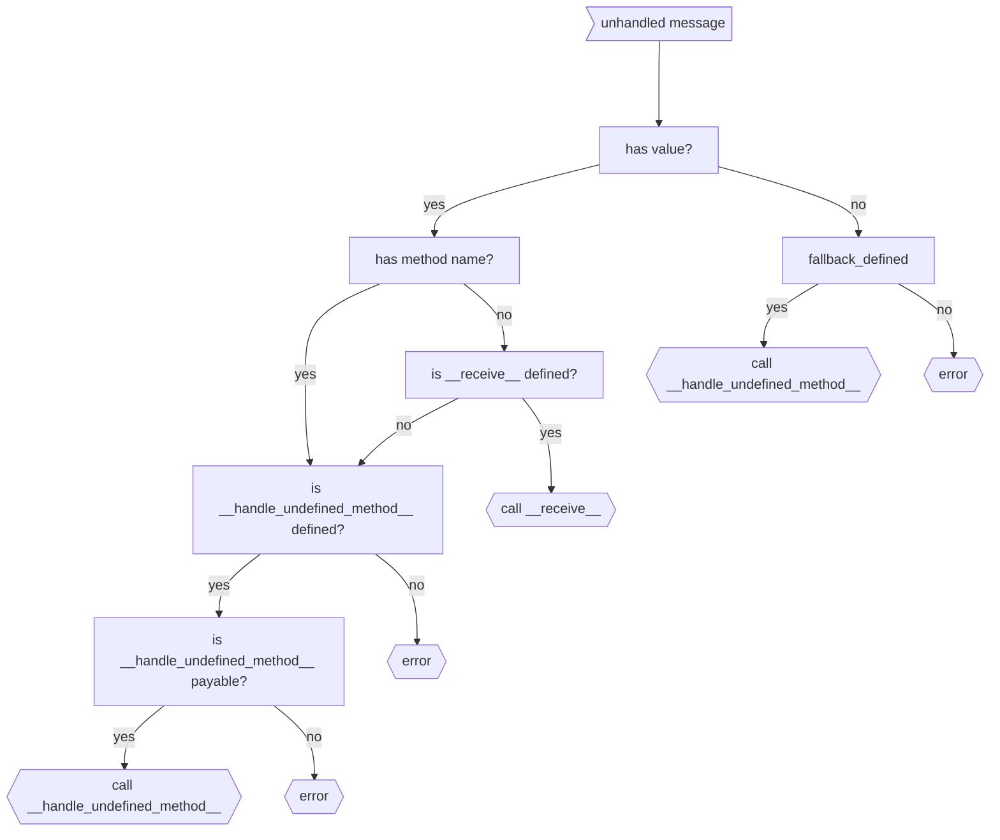

# Working With Balances

## Core concepts

Each contract has a `balance` property: both derivatives of `gl.Contract` and `gl.ContractAt`

All transactions and messages (both internal and external) can have attached `value`: `ContractAt(...).emit(value=100).my_method()`

To get `value` from the incoming message users can read `gl.message.value`

There is a special method to call a "nameless" transfer: `ContractAt(...).emit_transfer(value=100)`.
You can receive such transfers by overriding `__receive__(self)` method.

There are few simple rules:
1. If your method expects a `value`, annotate it with `@gl.public.write.payable` instead of just `write`
2. Emitting transaction to a non-payable method with non-zero value is an error
3. If transaction outcome is not *success*, attached value is sent back

## Code example

```python filename="working_with_balances" copy
class TokenForwarder(gl.Contract):
    vault_contract: Address

    def __init__(self, vault_contract: str):
        self.vault_contract = Address(vault_contract)

    @gl.public.write.payable
    def forward(self) -> None:
        vault = gl.ContractAt(self.vault_contract)
        amount = gl.message.value
        vault.emit_transfer(value=amount)


    @gl.public.write.payable
    def donate_twice(self) -> bool:
        vault = gl.ContractAt(self.vault_contract)
        amount = gl.message.value
        if self.balance < amount:
            return False
        vault.emit(value=amount*2).save(self.address)
        return True
```

## Special methods

There are two special methods allowed in each contract **definition**:
```python
class Contract(gl.Contract):
    @gl.public.write # .payable?
    def __handle_undefined_method__(
        self, method_name: str, args: list[typing.Any], kwargs: dict[str, typing.Any]
    ):
        """
        Method that is called for undefined method calls,
        must be either ``@gl.public.write`` or ``@gl.public.write.payable``
        """
        ...

    @gl.public.write.payable
    def __receive__(self):
        """
        Method that is called for no-method transfers,
        must be ``@gl.public.write.payable``
        """
        ...
```

Below is a diagram that shows how GenVM decides which method to pick, in case any regular method did not match:


