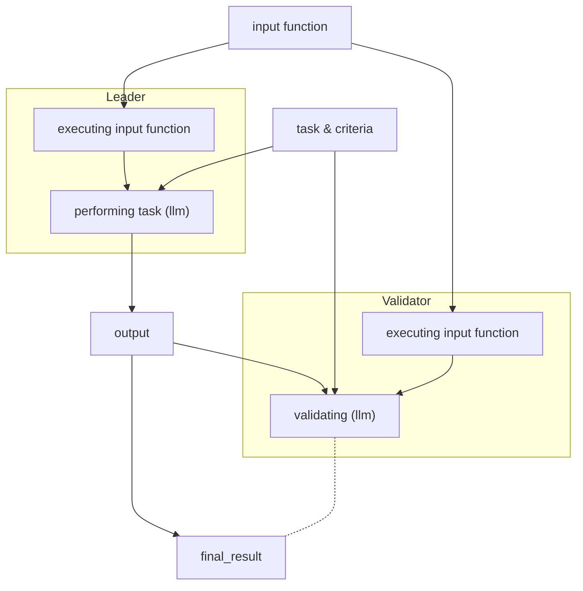

import { Callout } from 'nextra-theme-docs'

# Managing Intelligent Contract Operations with the Equivalence Principle

The Equivalence Principle is a core concept in GenLayer's Intelligent Contract framework. It ensures consistency and reliability when handling non-deterministic operation results, such as responses from Large Language Models or web data retrieval, by establishing a standard for validators to agree on the correctness of these outputs. These functions give users detailed control over how the outputs are validated.

Depending on how you want the validators to work, you can choose from a few options, such as a principle that uses LLMs or one that just uses a strict comparison.

<Callout emoji="💡">
    Advanced users may also choose to write their own equivalence principle
</Callout>


The Equivalence Principle involves multiple validators randomly selected to determine whether different outputs from non-deterministic operations can be considered equivalent. One validator acts as the leader, proposing the output, while others validate it and then return it instead of their computation.

## Equivalence Principles Options

Validators work to reach a consensus on whether the result set by the leader is acceptable, which might involve direct comparison or qualitative evaluation, depending on the contract's design. If the validators do not reach a consensus due to differing data interpretations or an error in data processing, the transaction will become undetermined.

### Comparative Equivalence Principle

In the Comparative Equivalence Principle, the leader and the validators perform identical tasks and then directly compare their respective results with the predefined criteria to ensure consistency and accuracy. This method uses an acceptable margin of error to handle slight variations in results between validators and is suitable for quantifiable outputs. However, computational demands and associated costs increase since multiple validators perform the same tasks as the leader.

```python
gl.eq_principle_prompt_comparative(
    your_non_deterministic_function,
    "The result must not differ by more than 5%"
)
```
For example, if an intelligent contract is tasked with fetching the follower count of a Twitter account and the Equivalence Principle specifies that _follower counts should not differ by more than 5%_, validators will compare their results to the leader's result utilizing their own LLMs to ensure they fall within this margin.

### Non-Comparative Equivalence Principle

GenLayer SDK provides function `gl.eq_principle_prompt_non_comparative` for handling most scenarios that require performing subjective NLP tasks

#### Non-Comparative Equivalence Principle Parameters

The `eq_principle_prompt_non_comparative` function takes three key parameters that define how validators should evaluate non-deterministic operations:

1. **input** (function)
   - The original input data that needs to be processed
   - Can be any data type (string, number, object, etc.)
   - Example: A text description that needs to be classified

2. **task** (str)
   - Describes the specific operation that needs to be performed
   - Should be a clear, concise instruction
   - Example: "Classify the sentiment of this text as positive, negative, or neutral"

3. **criteria** (str)
   - Defines the validation rules or acceptance criteria
   - Can be either a list of requirements or a dictionary of validation parameters
   - Used by validators to determine if an output is acceptable
   - Example:
   ```python
   criteria = [
       "Output must be one of: positive, negative, neutral",
       "Classification should consider context and tone",
       "Sarcasm should be properly identified"
   ]
   ```

#### Example Usage

```python
@gl.contract
class SentimentAnalyzer:
    @gl.public.write
    @gl.non_comparative_validation
    def analyze_sentiment(self, text: str) -> str:
        return eq_principle_prompt_non_comparative(
            input=text,
            task="Classify the sentiment of this text",
            criteria=[
                "Output must be one of: positive, negative, neutral",
                "Consider context and tone",
                "Account for sarcasm and idioms"
            ]
        )
```

In this example:
- `input` is the text to analyze
- `task` defines what operation to perform
- `criteria` ensures consistent validation across validators without requiring exact output matching

#### Data flow

