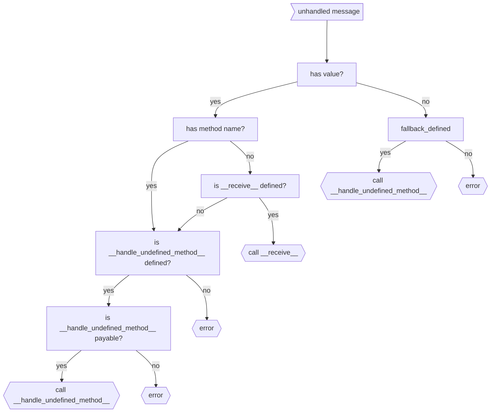

# Special Methods

There are two special methods allowed in each contract **definition**:
```python
class Contract(gl.Contract):
    @gl.public.write # .payable?
    def __handle_undefined_method__(
        self, method_name: str, args: list[typing.Any], kwargs: dict[str, typing.Any]
    ):
        """
        Method that is called for undefined method calls,
        must be either ``@gl.public.write`` or ``@gl.public.write.payable``
        """
        ...

    @gl.public.write.payable
    def __receive__(self):
        """
        Method that is called for no-method transfers,
        must be ``@gl.public.write.payable``
        """
        ...
```

Below is a diagram that shows how GenVM decides which method to pick, in case any regular method did not match:


