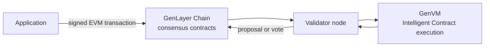

import { Card, Cards } from "nextra-theme-docs";

# Discover the GenLayer protocol

GenLayer is an intelligent blockchain for applications that need consensus on outcomes derived from natural language, live web data, or other non-deterministic inputs.

Intelligent Contracts divide execution into deterministic code and isolated non-deterministic operations. A selected leader proposes an execution result, a validator committee evaluates it under the contract's equivalence rule, and the onchain consensus system coordinates appeals and finality.

## Start here

<Cards>
  <Card title="What is GenLayer?" href="/understand-genlayer-protocol/what-is-genlayer" />
  <Card title="How GenLayer works" href="/understand-genlayer-protocol/optimistic-democracy-how-genlayer-works" />
  <Card title="Use cases" href="/understand-genlayer-protocol/typical-use-cases" />
  <Card title="Core concepts" href="/understand-genlayer-protocol/core-concepts" />
</Cards>

## Architecture at a glance

- **GenLayer Chain** orders actions and stores the authoritative consensus state.
- **Validator nodes** watch the chain, maintain derived Intelligent Contract state, and perform assigned consensus duties.
- **GenVM** runs Intelligent Contracts in a WebAssembly sandbox and isolates web and LLM operations.

Each Intelligent Contract has an EVM-facing Ghost contract at the same address. The Ghost routes calls and messages between GenLayer Chain and GenVM.

## Explore by topic

<Cards>
  <Card title="Architecture and GenVM" href="/understand-genlayer-protocol/core-concepts/rollup-integration" />
  <Card title="Non-deterministic operations" href="/understand-genlayer-protocol/core-concepts/non-deterministic-operations-handling" />
  <Card title="Optimistic Democracy" href="/understand-genlayer-protocol/core-concepts/optimistic-democracy" />
  <Card title="Equivalence Principle" href="/understand-genlayer-protocol/core-concepts/optimistic-democracy/equivalence-principle" />
  <Card title="Transactions and finality" href="/understand-genlayer-protocol/core-concepts/transactions" />
  <Card title="Protocol economics" href="/understand-genlayer-protocol/core-concepts/economic-model" />
</Cards>

For the extended architectural rationale, read [Making GenLayer 100% Secure, Part 1: The Architecture](https://genlayer.com/blog/making-genlayer-100-percent-secure-part-1-the-architecture).
