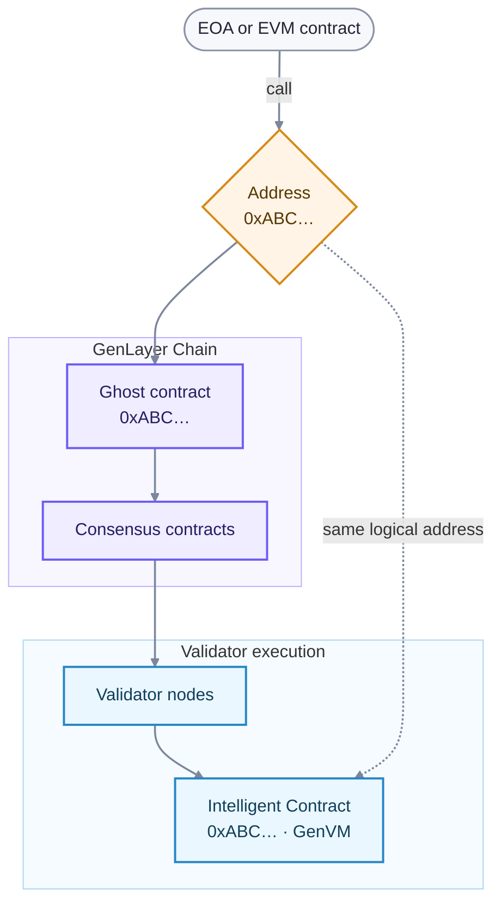

# Accounts and addresses

GenLayer uses Ethereum-style, `0x`-prefixed addresses. The meaning of an address depends on whether it identifies an externally owned account (EOA), an EVM contract, or an Intelligent Contract and its Ghost.

## Account types

| Account | Controlled or executed by | Can initiate an EVM transaction? | Where code runs |
| --- | --- | --- | --- |
| EOA | A private key or smart-account policy | Yes | No contract code |
| EVM contract | EVM bytecode | Through calls and messages | GenLayer Chain |
| Intelligent Contract | GenVM code | Through its Ghost and message system | GenVM |

## Intelligent Contracts and Ghosts share an address

Deploying an Intelligent Contract creates a Ghost contract on GenLayer Chain and the corresponding Intelligent Contract in GenVM. Both use the same address.

The Ghost is an EVM-facing proxy for protocol integration, not a second copy of the Intelligent Contract logic. It holds the address's native GEN balance on GenLayer Chain and forwards calls into consensus. If GenVM deployment fails, the Ghost can remain as the address placeholder for a later successful deployment.

## Accounts also define execution order

The consensus system maintains state and queues for each Intelligent Contract recipient. Transactions addressed to the same Intelligent Contract pass through the active proposal and voting phases sequentially. This keeps later state changes from overtaking an earlier unresolved state change.

Transactions to different Intelligent Contracts can progress independently.

## Keys and security

An EOA address is derived from its public key and controlled by the corresponding private key. Never put a private key or recovery phrase in contract code, frontend source, logs, or documentation examples. Use a wallet or managed signer to sign transactions.

Validator accounts use a separate owner/operator model. See [staking](/understand-genlayer-protocol/core-concepts/optimistic-democracy/staking) for those roles.

## Related developer guides

- [Deploy an Intelligent Contract](/developers/intelligent-contracts/deploying)
- [Call Intelligent Contracts](/developers/decentralized-applications/writing-data)
- [Messages and Ghost contracts](/developers/intelligent-contracts/features/messages)
