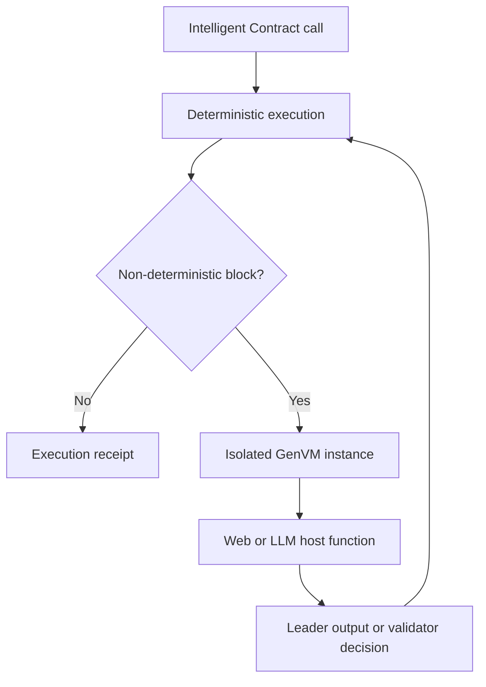

# GenVM

GenVM is the execution environment for Intelligent Contracts. It runs contract code in a WebAssembly sandbox and exposes controlled host functions for contract state, messages, web access, and LLM calls.

[View the GenVM source code](https://github.com/genlayerlabs/genvm).

## Execution model

GenVM separates reproducible execution from operations that can vary across validators.

The top-level contract path must be deterministic. A non-deterministic block runs in a separate VM instance so that its transient memory and side effects cannot leak directly into deterministic state. Only the block's returned value crosses the boundary.

In leader mode, the block produces the candidate value used by the transaction. In validator mode, it evaluates the leader's value and returns whether it is acceptable. Consensus, not GenVM alone, decides whether the receipt is accepted.

## Runners and languages

GenVM executes WebAssembly contracts through **runners**. A runner packages the language runtime or other support code a contract needs and identifies that package by a human-readable name and content hash. Pinning the runner makes the execution environment explicit and reproducible across nodes.

The standard developer experience uses Python on a CPython WebAssembly runner. The runtime boundary is WebAssembly/WASI, so the architecture can support other compatible runners and compiled languages as they become available.

## Security boundary

GenVM constrains contract capabilities through its WebAssembly runtime and host interface. Intelligent Contracts do not receive unrestricted access to the validator machine. Web and LLM functions are available through the non-deterministic interface, where their output is subject to the contract's [equivalence rule](/understand-genlayer-protocol/core-concepts/optimistic-democracy/equivalence-principle).

For code and API details, see [your first Intelligent Contract](/developers/intelligent-contracts/first-contract) and [non-determinism](/developers/intelligent-contracts/features/non-determinism).
