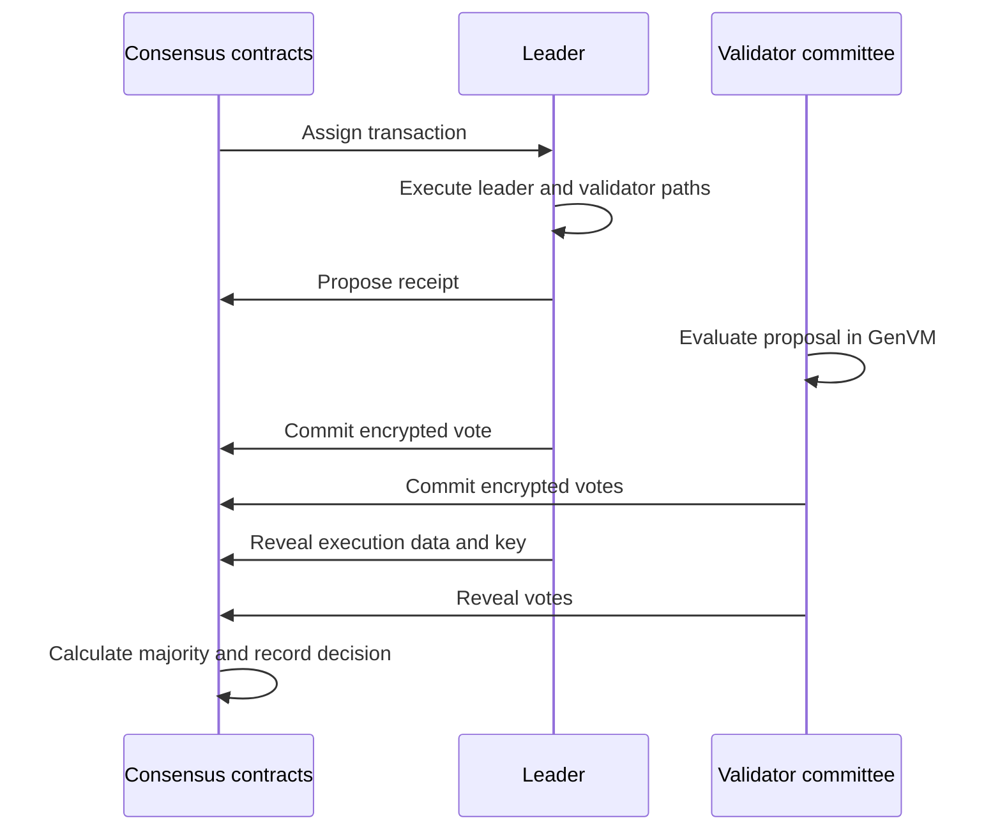

# Optimistic Democracy

Optimistic Democracy is GenLayer's protocol for deciding Intelligent Contract outcomes. A randomly selected leader proposes an execution result, a stake-weighted committee evaluates it, and the decision becomes final unless someone funds a valid appeal.

It is **optimistic** because the protocol starts with a small committee and finalizes an uncontested result after an appeal window. It is **democratic** because a majority of independently selected validators decides whether the proposal is acceptable.

## One consensus round

The committee checks two kinds of work:

- Deterministic execution must reproduce the leader's proposed state transition exactly.
- Non-deterministic outputs must satisfy the contract's [Equivalence Principle](/understand-genlayer-protocol/core-concepts/optimistic-democracy/equivalence-principle).

The commit-reveal process hides votes until commitments are fixed. A separate leader-revealing phase exposes the leader's execution data before the remaining validators reveal.

## Possible decisions

- **Accepted**: The committee reached the required majority on the proposed outcome.
- **ValidatorsTimeout**: A majority reported that validation could not finish within its execution allowance.
- **LeaderTimeout**: The leader reported that it could not produce a proposal within its allowance.
- **Undetermined**: The round could not reach consensus and no funded rotation remained.

Accepted describes agreement, not whether the contract returned without an error. A receipt that contains a contract error can still be Accepted when validators agree that it is the correct result.

## Appeals scale review

Anyone can challenge an eligible decision during its appeal window by posting the required bond. The protocol distinguishes:

- a **validator appeal**, which asks fresh validators to re-evaluate the existing proposal; and
- a **leader appeal**, which starts another proposal round after an Undetermined or LeaderTimeout result.

Further appeals use larger committees and exclude validators already consumed by the relevant appeal selection. This increases the cost of sustaining an incorrect result while avoiding the expense of involving the whole active set in routine transactions.

Read [appeals](/understand-genlayer-protocol/core-concepts/optimistic-democracy/appeal-process) and [finality](/understand-genlayer-protocol/core-concepts/optimistic-democracy/finality) for the next steps in the lifecycle.

