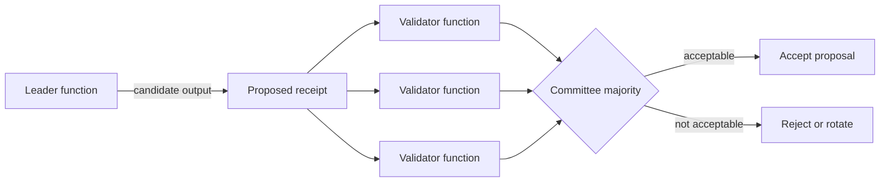

# Equivalence Principle

The Equivalence Principle is the rule an Intelligent Contract uses to decide whether a leader's non-deterministic output is acceptable. It allows validators to agree on meaning or required properties even when their raw LLM or web results are not byte-for-byte identical.

The principle is implemented as contract code. It is not a network-wide similarity threshold, and it does not mean that validators trust the leader.

## Leader and validator responsibilities

The leader function produces the value that the surrounding deterministic code can use. Each validator function receives that value and independently returns an accept or reject decision. Intermediate validator results do not automatically become contract state.

## Validation patterns

### Strict equality

Use strict equality when validators can normalize an operation to exactly the same bytes. Examples include stable structured data with canonical serialization. Strict equality is usually unsuitable for open-ended LLM responses or time-varying data.

### Independent comparison

The validator repeats the task and compares the decision-bearing fields. It can require exact labels, allow a numeric tolerance, or use an LLM to compare two complex outputs against explicit criteria.

### Independent assessment

The validator evaluates the leader's output directly against the original evidence and criteria without producing a second candidate answer. This can reduce duplicated work, but the validator must still consult independent evidence. Checking only that the leader returned valid JSON or an allowed enum does not verify the answer.

### Custom validation

Most contracts use a custom leader/validator pair because it can combine objective checks, source retrieval, tolerances, and qualitative judgment. Convenience wrappers exist for common strict, comparative, and non-comparative cases.

## Design principles

- Define what must agree and what may vary.
- Compare structured decision fields instead of incidental prose.
- Give validators the same source evidence and explicit criteria.
- Reject malformed outputs before applying subjective checks.
- Define behavior for source failures, model errors, and timeouts.
- Keep side effects outside the non-deterministic block so state changes use only the accepted value.

For current APIs, security guidance, and examples, use the canonical developer guide: [Implement the Equivalence Principle](/developers/intelligent-contracts/equivalence-principle).
