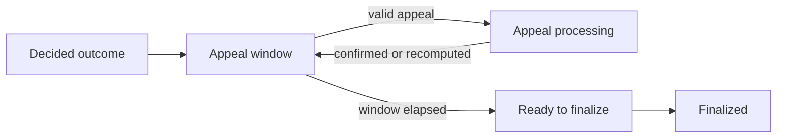

# Finality

An Intelligent Contract transaction is final when the consensus decision can no longer be appealed and the protocol has moved it to `Finalized`. Until then, an accepted result is provisional.

## Decision, appeal window, and finalization

The appeal window starts after a decided outcome such as Accepted, Undetermined, ValidatorsTimeout, or LeaderTimeout. Its duration is governed by the protocol configuration. Applications should read the effective transaction status rather than assume a fixed number of seconds.

After the window expires, the transaction can report `ReadyToFinalize`. Anyone can then submit the onchain finalization action. `ReadyToFinalize` means the deadline has passed; `Finalized` means the state transition has been recorded.

## Accepted is not final

An Accepted receipt can influence the contract's provisional execution chain, but a successful appeal can require it and later non-finalized transactions for the same Intelligent Contract to be recomputed. Applications that need irreversible settlement should wait for `Finalized`.

Accepted also does not mean “execution succeeded.” It means the committee agreed on the receipt. The agreed receipt can contain a user error or a GenVM error.

## Messages at different stages

An Intelligent Contract can schedule messages for acceptance or finalization. On-acceptance messages are emitted when the transaction is accepted and are not revoked by a later appeal. Use them only for effects that are safe before finality. On-finalization messages are emitted only after the transaction finalizes.

See [messages](/developers/intelligent-contracts/features/messages) for developer guidance.

## Two layers of confirmation

The EVM transaction that submitted an Intelligent Contract call can be included on GenLayer Chain before the Intelligent Contract transaction finishes consensus. Therefore:

- an EVM receipt confirms that the submission was included; and
- the GenLayer transaction status confirms the Intelligent Contract outcome.

Use [`gen_getTransactionStatus`](/api-references/genlayer-node/gen/gen_getTransactionStatus) for lightweight polling or [`gen_getTransactionReceipt`](/api-references/genlayer-node/gen/gen_getTransactionReceipt) for the full consensus receipt.
