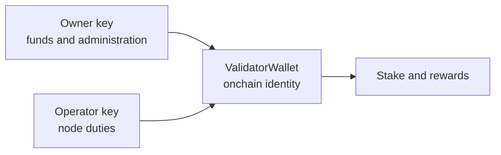

import { Callout } from "nextra-theme-docs";

# Staking

Validators stake GEN to become eligible for consensus duties. Other token holders can delegate GEN to a validator without operating a node. Stake secures the protocol, influences validator selection, earns rewards, and remains exposed to protocol penalties.

## Validators and delegators

| Participant | Provides | Current minimum | Receives |
| --- | --- | ---: | --- |
| Validator owner | Self-stake and node operation | 42,000 GEN | Stake-pool rewards and validator-owner rewards |
| Delegator | Stake assigned to a validator | 42 GEN | A proportional share of that validator's stake-pool rewards |

Minimums and the maximum active-set size are governance-configurable. Check current network configuration before transacting.

## Owner, operator, and ValidatorWallet

A validator separates control of funds from day-to-day node operation.



- The **owner key** joins, deposits, exits, claims, changes the operator, and controls the validator identity. Keep it offline when practical.
- The **operator key** signs activations, proposals, commits, and reveals. It is the hot key configured on the node and can be replaced by the owner.
- The **ValidatorWallet** is a smart contract created when the validator joins. It is the validator's onchain identity and holds its stake accounting. It has no private key.

<Callout type="warning">
  Losing the owner key can permanently prevent exits, claims, and operator changes. The node stores only the operator key; it cannot recover the owner key.
</Callout>

## Selection weight

The protocol derives committee-selection weight from self-stake and delegated stake:

```text
weight = (alpha × self-stake + (1 - alpha) × delegated stake) ^ beta
```

Current defaults are `alpha = 0.6` and `beta = 0.5`. Self-stake therefore contributes more per GEN than delegated stake, while the square-root-like damping reduces concentration advantages. The activator role is selected uniformly and does not use this weight.

## Shares and compounding

Stake pools use shares. A deposit receives shares representing a fraction of the pool. Rewards increase the GEN represented by each share; slashes decrease it. This lets rewards compound without issuing new shares for every epoch.

Delegation increases a validator's selection weight, but delegates also share the economic performance and slash exposure of that pool.

## Epoch activation and priming

Deposits, withdrawals, rewards, and penalties are staged across epochs rather than changing the active set immediately. Under the current rules, new validator and delegation deposits become active two epochs later.

`validatorPrime()` processes a validator's pending epoch changes, applies rewards and matured penalties, and places eligible stake in the selection structure for the next epoch. The call is permissionless. A validator that is not primed is excluded from the next selection set until processing catches up.

## Rewards and risks

Validators and delegators share the stake portion of transaction fees and inflation. Validator owners also receive the protocol's operations allocation. Exact rates and routing are protocol parameters; see the [economic model](/understand-genlayer-protocol/core-concepts/economic-model).

Stake can lose value through penalties. Validators can also be temporarily banned or quarantined, which prevents new selection. Read [slashing](/understand-genlayer-protocol/core-concepts/optimistic-democracy/slashing) before choosing a validator.

For transactions and command examples, use the [staking guide](/developers/staking-guide) and [validator setup guide](/validators/setup-guide).
