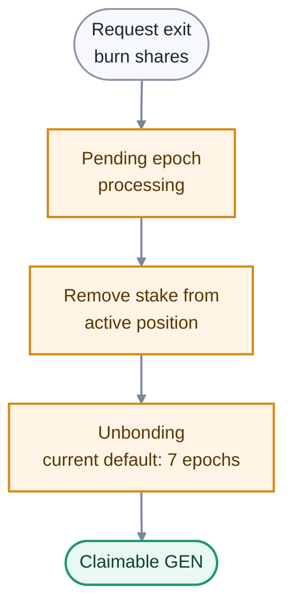

# Unstaking

Unstaking converts validator or delegator shares into a scheduled GEN withdrawal. An exit is processed through epoch accounting, stops earning after the exited stake leaves the active record, and becomes claimable after the unbonding period.

It does not wait for every transaction in which the validator participated to finalize.

## Exit lifecycle

1. The validator owner or delegator chooses a positive number of shares and submits an exit.
2. The protocol stages the withdrawal and processes it through the validator's epoch records and `validatorPrime()`.
3. Once removed from active stake, those shares no longer contribute to selection weight or earn rewards.
4. After the unbonding period, anyone can trigger the claim for the beneficiary. Funds go to the owner or delegator, not the caller.

Under the current rules, the exit epoch still earns its normal rewards, and the unbonding period is seven epochs measured from the exit request. These values are protocol parameters.

## Validator exits

A validator can exit part of its shares and remain eligible if the resulting self-stake still meets the active minimum. A full exit, or a partial exit below the minimum, removes it from new consensus selection after the staged update takes effect.

The owner key controls validator exits and claims. The node's operator key cannot withdraw stake.

## Delegator exits

A delegator exits shares separately for each validator pool. Multiple matured withdrawals can be claimed together according to the staking contract's accounting. During unbonding, exited stake earns no rewards and remains subject to the protocol rules attached to the withdrawal record.

Use current contract views or the SDK to calculate shares and claimability; do not convert a desired GEN amount to shares using a stale exchange rate.

For step-by-step commands, see the [staking guide](/developers/staking-guide).
