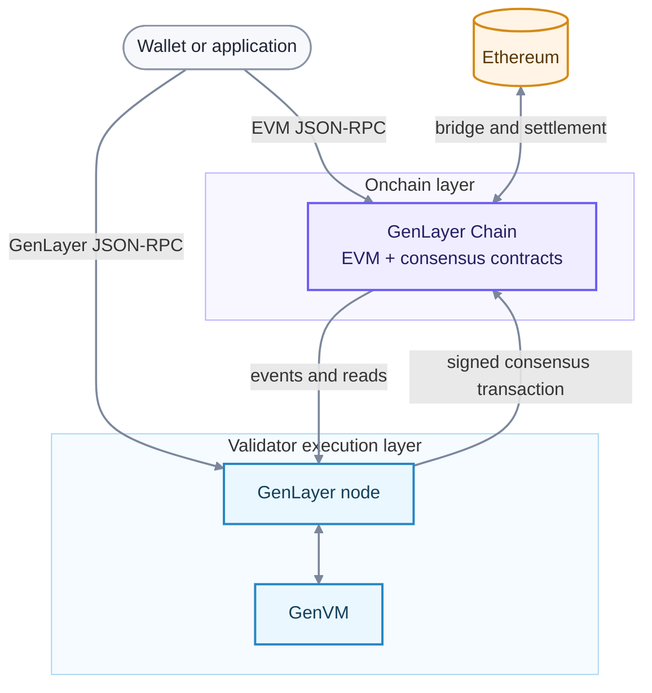

# GenLayer Chain integration

GenLayer Chain is an EVM-compatible chain built with the ZK Stack. It hosts ordinary Solidity contracts and the consensus contracts that coordinate Intelligent Contract execution. GenVM is a separate execution environment operated by nodes; it is not an EVM precompile or an Ethereum rollup execution engine.

## What lives on GenLayer Chain

The chain provides ordering, availability, and an authoritative state machine for consensus. Its contracts record:

- Intelligent Contract transactions and per-contract queues;
- activator, leader, and committee assignments;
- proposal, commit, reveal, decision, and appeal state;
- validator staking, fees, and penalties; and
- Ghost contracts that connect EVM accounts to Intelligent Contracts.

Because consensus actions are chain transactions, validators do not need a separate peer-to-peer network to agree on an Intelligent Contract result. Chain time and state determine whether a phase is open or a participant is idle.

## What lives in GenVM

Intelligent Contract code and state execute in GenVM. Nodes reconstruct the accepted Intelligent Contract state by following GenLayer Chain events and replaying the corresponding state transitions. The consensus contracts store commitments and lifecycle data; they do not execute Python contract logic.

## Ghost contracts bridge the environments

Every Intelligent Contract has a Ghost contract on GenLayer Chain at the same address. A Ghost:

- receives EVM transactions addressed to the Intelligent Contract;
- holds its native GEN balance on the EVM side;
- forwards Intelligent Contract calls to the consensus system; and
- delivers on-acceptance and on-finalization messages to EVM recipients.

The shared address gives wallets and EVM contracts one destination even though execution and balances span two environments. See [accounts and addresses](/understand-genlayer-protocol/core-concepts/accounts-and-addresses) and [messages](/developers/intelligent-contracts/features/messages).

## Settlement and protocol finality are different

GenLayer Chain inherits its rollup settlement properties from its ZK Stack and Ethereum configuration. Separately, an Intelligent Contract transaction reaches **protocol finality** only after its consensus decision and appeal window complete. Applications must use the Intelligent Contract transaction status—not only the enclosing EVM transaction receipt—to determine whether an outcome is final.
