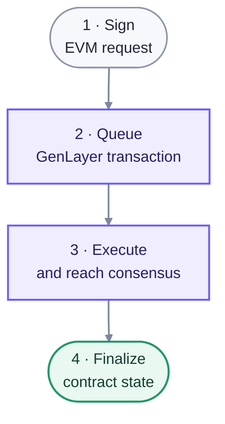

import { Card, Cards } from "nextra-theme-docs";

# Transactions

An Intelligent Contract interaction begins as an EVM transaction on GenLayer Chain and creates a protocol transaction managed by the consensus contracts. These are related records with different purposes and finality.

## EVM transaction

The caller signs an Ethereum-compatible transaction addressed to an Intelligent Contract's Ghost or to a consensus deployment function. Inclusion of this transaction confirms that GenLayer Chain received the request. Standard EVM fields include the sender, destination, nonce, value, gas parameters, and encoded calldata.

Ordinary GEN transfers and calls to Solidity contracts can complete entirely on this EVM layer. They do not enter Optimistic Democracy unless they create an Intelligent Contract transaction.

## GenLayer transaction

The consensus contracts assign an Intelligent Contract request its transaction ID and lifecycle state. The record includes:

- the original EVM initiator, immediate sender, and Intelligent Contract recipient;
- encoded contract call or deployment data;
- the activator, committee, leader, and round history;
- execution commitments, equivalence-block outputs, and votes;
- phase timestamps, fee accounting, and appeal bonds; and
- the current protocol status and decided execution result.

The protocol transaction can remain in consensus after the EVM submission is mined. Applications that require the Intelligent Contract outcome must follow the GenLayer transaction until `Finalized`.

## Ordering

Each Intelligent Contract has its own pending and decided queues. Transactions for the same recipient move through the active proposal and voting phases sequentially because later calls can depend on earlier state. Transactions to different recipients can progress independently.

Messages emitted by Intelligent Contracts also create transactions and preserve their dependency on the parent transaction's state and fee allocation.

<Cards>
  <Card title="Transaction types" href="/understand-genlayer-protocol/core-concepts/transactions/types-of-transactions" />
  <Card title="Transaction execution" href="/understand-genlayer-protocol/core-concepts/transactions/transaction-execution" />
  <Card title="Transaction statuses" href="/understand-genlayer-protocol/core-concepts/transactions/transaction-statuses" />
  <Card title="Encoding and signing" href="/understand-genlayer-protocol/core-concepts/transactions/transaction-encoding-serialization-and-signing" />
</Cards>

For the current receipt schema, see [`gen_getTransactionReceipt`](/api-references/genlayer-node/gen/gen_getTransactionReceipt).
