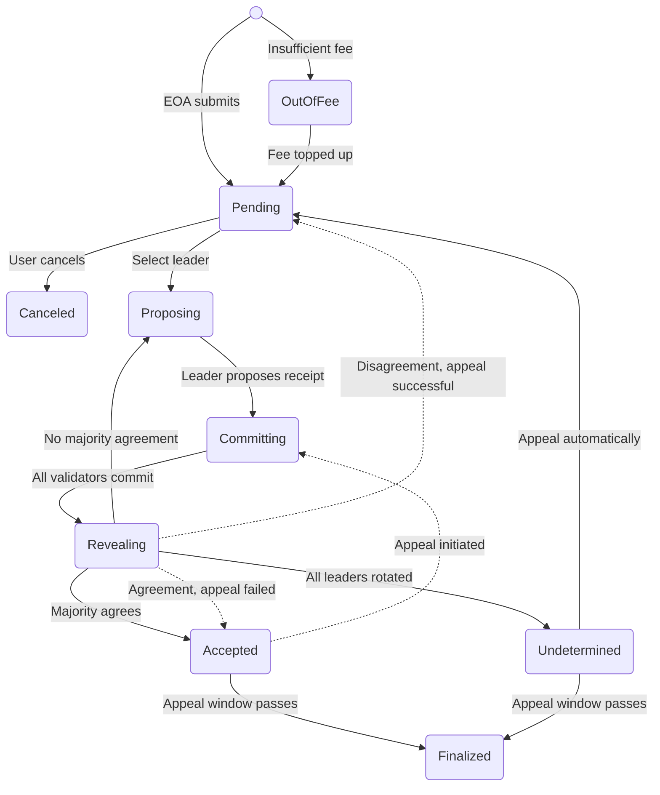

## Transaction execution
Once a transaction is received and properly verified by the `eth_sendRawTransaction` method on the RPC server, it is stored with a PENDING status and its hash is returned as the RPC method response. This means that the transaction has been validated for authenticity and format, but it has not yet been executed. From this point, the transaction enters the GenLayer consensus mechanism, where it is picked up for execution by the network's validators according to the consensus rules.

As the transaction progresses through various stages—such as proposing, committing, and revealing—its status is updated accordingly. Throughout this process, the current status and output of the transaction can be queried by the user. This is done by calling the `eth_getTransactionByHash` method on the RPC server, which retrieves the transaction's details based on its unique hash. This method allows users to track the transaction's journey from submission to finalization, providing transparency and ensuring that they can monitor the outcome of their transactions in real-time.

### Transaction Status Transitions

In the journey of a transaction within the GenLayer protocol, it begins its life when an Externally Owned Account (EOA) submits it, entering the `Pending` state. Here, it awaits further processing unless it encounters an `OutOfFee` state due to insufficient fees. If the fees are topped up, it returns to `Pending`. Alternatively, the user can cancel the transaction, moving it to the `Canceled` state.

From `Pending`, the transaction progresses to the `Proposing` stage, where a leader is selected to propose a receipt. Upon successful proposal, it advances to the `Committing` stage, where all validators must commit to the transaction. If all validators commit, the transaction moves to the `Revealing` stage.

In the `Revealing` stage, the transaction's fate is determined. If a majority agrees, it is `Accepted`. However, if there is no majority agreement, it returns to `Proposing`. If all leaders are rotated without agreement, it becomes `Undetermined`. In cases of disagreement, a successful appeal can revert it to `Pending`, while a failed appeal results in `Accepted`.

Once `Accepted`, the transaction awaits the passing of the appeal window to become `Finalized`. An `Undetermined` transaction also becomes `Finalized` after the appeal window passes. However, an appeal can initiate a return to `Committing` from `Accepted`, or automatically revert an `Undetermined` transaction to `Pending`.

