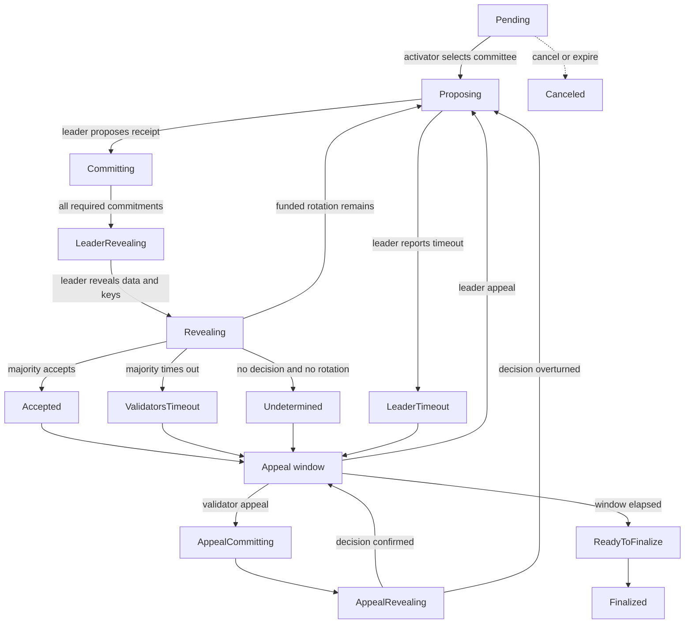

# Transaction execution

After an EVM submission creates a GenLayer transaction, the consensus contracts coordinate execution as an onchain state machine. Validator nodes observe the current phase, perform work in GenVM, and submit the next signed consensus action.

```mermaid
flowchart TD
    A[Pending] -->|activator selects committee| B[Proposing]
    B -->|leader proposes receipt| C[Committing]
    C -->|all required commitments| D[LeaderRevealing]
    D -->|leader reveals data and keys| E[Revealing]
    E -->|majority accepts| F[Accepted]
    E -->|majority times out| VT[ValidatorsTimeout]
    E -->|no decision and no rotation| U[Undetermined]
    E -->|funded rotation remains| B
    B -->|leader reports timeout| LT[LeaderTimeout]

    F --> W[Appeal window]
    VT --> W
    U --> W
    LT --> W
    W -->|validator appeal| AC[AppealCommitting]
    AC --> AR[AppealRevealing]
    AR -->|decision confirmed| W
    AR -->|decision overturned| B
    W -->|leader appeal| B
    W -->|window elapsed| RF[ReadyToFinalize]
    RF --> FIN[Finalized]

    A -.->|cancel or expire| X[Canceled]
```

## Pending and activation

Transactions enter the recipient Intelligent Contract's pending queue. The assigned activator advances the transaction when it reaches the queue head. Activation fixes the selection seed, locks applicable fee prices, selects the stake-weighted committee, and chooses a leader.

## Proposal

The leader executes the call in GenVM and submits a receipt with the proposed execution result and state changes. It also executes the validator path so it can vote with the committee.

If the leader cannot finish within its allocated execution time, it can report a leader timeout. If the leader is idle, a permissionless timeout action can rotate it when the transaction has funded rotations available.

## Commit, leader reveal, and vote reveal

Committee members validate deterministic execution and apply the contract's equivalence rules to non-deterministic outputs. They commit encrypted votes and result hashes before seeing the other revealed votes.

The leader reveals its execution data and decryption keys in `LeaderRevealing`. Committee members then reveal their votes in `Revealing`. The consensus contracts calculate the majority from the revealed votes.

## Decision and appeals

Accepted, ValidatorsTimeout, Undetermined, and LeaderTimeout are decided outcomes that enter an appeal window. Validator appeals use a fresh committee to check the existing proposal. Leader appeals begin another proposal round. See [appeals](/understand-genlayer-protocol/core-concepts/optimistic-democracy/appeal-process).

## Finalization

When the effective appeal window has elapsed, the transaction is ready to finalize. The finalization call records the terminal status, settles remaining fees and refunds, emits finalization messages, and advances the recipient's queues.

An EVM submission receipt is not a substitute for this lifecycle. Poll [`gen_getTransactionStatus`](/api-references/genlayer-node/gen/gen_getTransactionStatus) or retrieve the full [`gen_getTransactionReceipt`](/api-references/genlayer-node/gen/gen_getTransactionReceipt).
