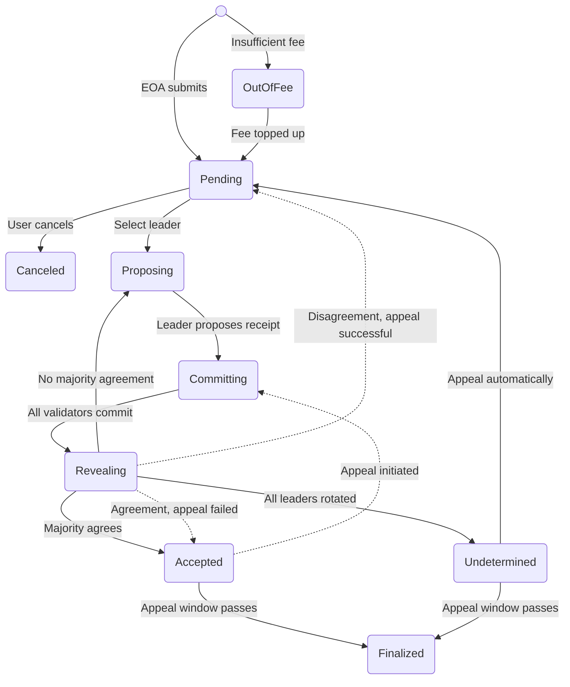

# Transaction execution
Transaction execution in GenLayer is the process that starts after `eth_sendRawTransaction` receives and verifies a transaction, stores it with a PENDING status, and returns its hash as the RPC response. At that point, the transaction has been validated for authenticity and format, but it has not yet been executed; it enters the GenLayer consensus mechanism, where the network's validators pick it up for execution according to the consensus rules.

As the transaction progresses through stages such as proposing, committing, and revealing, its status is updated accordingly. Users can query the current status and output of the transaction by calling the `eth_getTransactionByHash` method on the RPC server, which retrieves the transaction's details based on its unique hash. This method lets users track the transaction's journey from submission to finalization, providing transparency and helping them monitor transaction outcomes in real time.

## Transaction Status Transitions

In the journey of a transaction within the GenLayer protocol, it begins its life when an Externally Owned Account (EOA) submits it, entering the `Pending` state. Here, it awaits further processing unless it encounters an `OutOfFee` state due to insufficient fees. If the fees are topped up, it returns to `Pending`. Alternatively, the user can cancel the transaction, moving it to the `Canceled` state.

From `Pending`, the transaction progresses to the `Proposing` stage, where a leader is selected to propose a receipt. Upon successful proposal, it advances to the `Committing` stage, where all validators must commit to the transaction. If all validators commit, the transaction moves to the `Revealing` stage.

In the `Revealing` stage, the transaction's fate is determined. If a majority agrees, it is `Accepted`. However, if there is no majority agreement, it returns to `Proposing`. If all leaders are rotated without agreement, it becomes `Undetermined`. In cases of disagreement, a successful appeal can revert it to `Pending`, while a failed appeal results in `Accepted`.

Once `Accepted`, the transaction awaits the passing of the appeal window to become `Finalized`. An `Undetermined` transaction also becomes `Finalized` after the appeal window passes. However, an appeal can initiate a return to `Committing` from `Accepted`, or automatically revert an `Undetermined` transaction to `Pending`.

```mermaid
graph TD;
    Start(( )) -->|EOA submits| Pending(Pending)
    Start -->|Insufficient fee| OutOfFee(OutOfFee)
    OutOfFee -->|Fee topped up| Pending
    Pending -->|User cancels| Canceled(Canceled)

    Pending -->|Select leader| Proposing(Proposing)
    Proposing -->|Leader proposes receipt| Committing(Committing)
    Committing -->|All validators commit| Revealing(Revealing)

    Revealing -->|Majority agrees| Accepted(Accepted)
    Revealing -->|No majority agreement| Proposing
    Revealing -->|All leaders rotated| Undetermined(Undetermined)
    Revealing -.->|Disagreement, appeal successful| Pending
    Revealing -.->|Agreement, appeal failed| Accepted

    Accepted -->|Appeal window passes| Finalized(Finalized)
    Undetermined -->|Appeal window passes| Finalized
    Accepted -.->|Appeal initiated| Committing
    Undetermined -->|Appeal automatically| Pending
```
