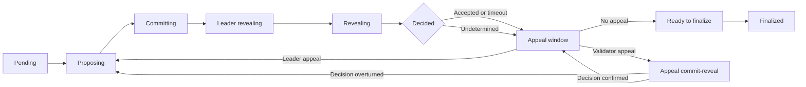

# How GenLayer works

GenLayer separates **ordering and consensus state** from **Intelligent Contract execution**. Consensus contracts on GenLayer Chain coordinate the process. Validator nodes execute the contract in GenVM and report their actions back to the chain.

## The three components

| Component | Responsibility |
| --- | --- |
| GenLayer Chain | Orders EVM transactions and stores authoritative consensus state, assignments, votes, fees, and final outcomes. |
| Validator node | Watches chain events, maintains derived Intelligent Contract state, performs assigned consensus duties, and serves GenLayer RPC requests. |
| GenVM | Executes Intelligent Contracts in a WebAssembly sandbox, including isolated web and LLM operations. |

This design makes phase deadlines and the order of consensus actions objectively observable. A proposal, commit, reveal, or appeal is a transaction to a consensus contract—not a message in a separate validator network.

## Transaction lifecycle

### 1. Submit and queue

A user or EVM contract sends a transaction to the Intelligent Contract's Ghost. The Ghost forwards the request to the consensus contracts, which assign a transaction ID and add it to the recipient's pending queue. Transactions for one Intelligent Contract are processed sequentially through the active consensus phases.

### 2. Activate and select

The protocol selects one validator uniformly from the active set to be the **activator**. Activation fixes the transaction's seed and selects a stake-weighted committee and its leader. The activator is excluded from the leader selection when it is also in the selected committee.

### 3. Propose

The leader runs the transaction in GenVM and proposes a receipt containing the execution result and state changes. The leader also runs the validator path and later votes as part of the committee.

### 4. Commit and reveal

Every committee member evaluates the leader's proposal. Deterministic execution must match. For each non-deterministic block, the validator applies the equivalence rule chosen by the contract developer.

Validators first commit encrypted votes. The leader then reveals its execution data and keys, after which the committee reveals its votes. This ordering prevents validators from adapting their votes to votes already made public.

### 5. Decide

A majority can accept the leader's proposal. The round can instead end in a validator timeout, leader timeout, or an undetermined result. When disagreement can still be retried within the transaction's funded execution budget, the protocol rotates the leader and starts another proposal round.

### 6. Appeal and finalize

Decided transactions enter an appeal window. Validator appeals recheck an Accepted or ValidatorsTimeout decision with a fresh committee. Leader appeals restart execution after an Undetermined or LeaderTimeout decision. If no valid appeal remains, anyone can finalize the transaction.

See [transaction execution](/understand-genlayer-protocol/core-concepts/transactions/transaction-execution), [appeals](/understand-genlayer-protocol/core-concepts/optimistic-democracy/appeal-process), and [finality](/understand-genlayer-protocol/core-concepts/optimistic-democracy/finality) for the detailed rules.

## Why results can differ

Web pages change, service responses vary, and LLMs do not always return identical text. GenLayer does not pretend these operations are deterministic. Instead, the contract divides execution into:

- deterministic code, which validators reproduce exactly; and
- non-deterministic blocks, whose proposed outputs validators assess using the [Equivalence Principle](/understand-genlayer-protocol/core-concepts/optimistic-democracy/equivalence-principle).

This makes the validation rule part of the application rather than an assumption hidden in infrastructure.
