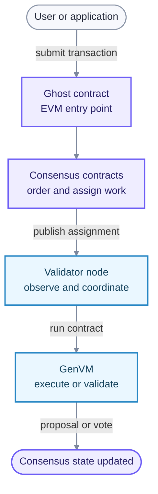

import { Card, Cards } from "nextra-theme-docs";

# What is GenLayer?

GenLayer is a blockchain for applications that need to make decisions from natural language, live web data, or other inputs that do not have one mechanically reproducible answer.

Traditional smart contracts require every node to calculate exactly the same result. An **Intelligent Contract** can instead ask a group of validators whether a proposed result is acceptable. This lets applications put judgment-based rules onchain without trusting one AI model, data provider, or operator.

## What GenLayer adds

Intelligent Contracts can:

- retrieve and interpret web content;
- use large language models (LLMs) to evaluate natural-language criteria;
- process unstructured inputs, such as text and images; and
- commit an accepted result to shared state.

Different validators can receive different raw answers. The contract defines how validators judge whether the leader's answer is acceptable through the [Equivalence Principle](/understand-genlayer-protocol/core-concepts/optimistic-democracy/equivalence-principle).

## How the protocol fits together

GenLayer has three cooperating components:

### GenLayer Chain

GenLayer Chain is an EVM-compatible ZK Stack chain. Solidity consensus contracts record transaction order, committee assignments, votes, appeals, and final outcomes. For the consensus process, this onchain state is authoritative.

### Validator nodes

Validator nodes watch the chain, perform their assigned duties, execute Intelligent Contracts in GenVM, and submit proposals or votes as EVM transactions. Validators do not run a separate peer-to-peer consensus network for Intelligent Contract outcomes.

### GenVM

GenVM is a WebAssembly-based sandbox for Intelligent Contracts. It keeps ordinary contract execution reproducible and runs web or LLM operations in isolated non-deterministic blocks. The leader proposes a result, and the selected validators apply the contract's validation rule to that proposal.

Each Intelligent Contract has a **Ghost contract** at the same address on GenLayer Chain. The Ghost receives EVM transactions, holds the contract's native-token balance, and routes messages between the EVM and GenVM sides.

## From submission to finality

1. A user sends an EVM transaction to an Intelligent Contract's Ghost.
2. The consensus contracts queue the transaction and select an activator, leader, and validator committee.
3. The leader executes the Intelligent Contract in GenVM and proposes a receipt.
4. The committee executes the validator path, commits encrypted votes, and then reveals them.
5. The protocol records the decision and opens an appeal window.
6. If nobody successfully appeals, the transaction becomes final.

An **Accepted** transaction is one whose proposed outcome reached consensus. It does not necessarily mean the contract returned successfully: validators can agree that an error is the correct execution result.

<Cards>
  <Card title="How GenLayer works" href="/understand-genlayer-protocol/optimistic-democracy-how-genlayer-works" />
  <Card title="Explore core concepts" href="/understand-genlayer-protocol/core-concepts" />
  <Card title="Build an Intelligent Contract" href="/developers/intelligent-contracts/first-contract" />
</Cards>

## When to use GenLayer

GenLayer is a fit when an outcome must be shared and enforceable, but determining it requires interpreting evidence or criteria. Examples include resolving a prediction market, assessing whether work meets a specification, or evaluating a claim from public sources.

Use a conventional smart contract for rules that can be expressed entirely as deterministic computation. Use a conventional backend when no shared, adversarially verifiable outcome is needed.

See [common use cases](/understand-genlayer-protocol/typical-use-cases) and the [builder fit checklist](/developers/intelligent-contracts/when-to-use-genlayer).
